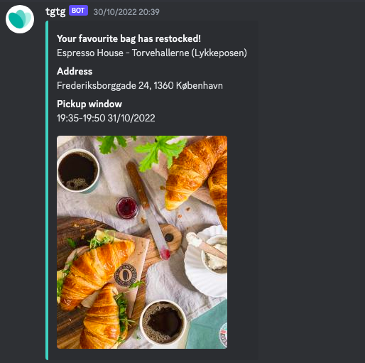

# Too Good To Go Monitor

## Description

This Python script monitors the Too Good To Go platform for changes in the availability of your favorite items and sends notifications to a Discord webhook when these items are restocked.

## Prerequisites

Before using this script, you will need:

- Required Python packages: `tgtg`, `discord_webhook`. You can install them using `pip`.

## Setup

1. Clone this repository or download the script to your local machine.

2. Install the required Python packages using the following command:

   ```bash
   pip install tgtg datetime discord-webhook
3. Set discord_hook_url
4. If you are logging in for the first time uncomment these lines to retrieve your tgtg credentials: 
   ```python
   # client = TgtgClient(email="your_email@example.com")
   # credentials = client.get_credentials()
   # print(credentials)
5. If set up correctly the script will start monitoring your favourite bags in the interval defined by 'CHECK_INTERVAL'. 




